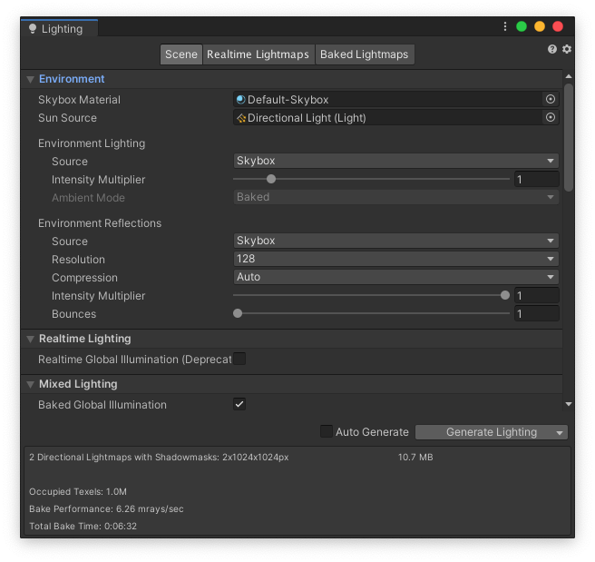
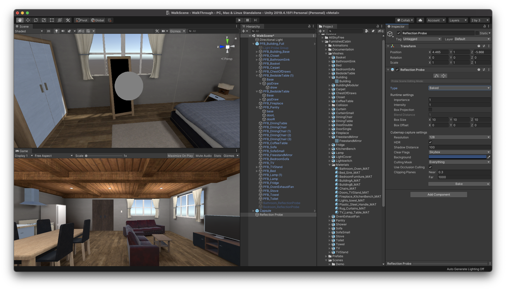
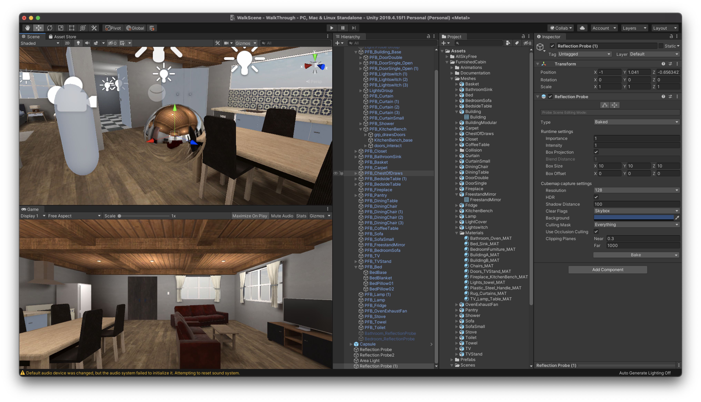

# 建物オブジェクトへの適用

## WalkThroughプロジェクトを開く

 

今回は前回までで学習したマテリアルの設定方法やライティングを実際の3Dオブジェクトに反映させる方法について解説していきます。

まずは以前作成した「WalkThrough」プロジェクトを開きましょう。  
他に3Dの屋内のデータがある場合はそちらを利用しても問題ありません。

 

プロジェクトを開いたら、プロジェクトウィンドウで新規フォルダを作成し、名前を「Prefabs」とします。  
そして、その中に以前作成したCapsuleをドラッグ&ドロップで入れてプレハブ化しておきましょう。

UnityHubを開き、右上の新規作成ボタンを押してください。

テンプレートは3Dのままで、プロジェクト名はなんでも構いません。ここでは「MaterialSample」としておきます。
保存先を決めたら作成ボタンを押してください。

 

Unityが開けたらUnityエディタのレイアウトを任意の形にしてください。
Unityエディタの右上の「Layout」から好きなレイアウトを設定できます。
こちらの教材では「2 × 3」を利用します。

そして新規で「Plane」を作成してください位置はX、Y、Z共に0にしておきましょう。

 

## シーンビューをゲームビューに合わせる

マテリアルの設定を見えやすくするためにシーンビューをゲームビューと同じカメラアングルに切り替えます。
 

ヒエラルキーウィンドウでMainCameraを選択してください。
そして、GameObjectメニューから「Align View to Selected」をクリックしてください。

 

そうすると、このようにゲームビューとシーンビューが同じ見た目になりました。  
これで準備は完了です。  

シーンビューが全体的に暗いといった場合は、Windowタブから「Rendering -> LightingSettings -> AutoGenerate」にチェックを入れてください。  
PCへの負荷がかかりますが、きちんと光が表現できるようになります。

 

## スフィアの作成

次にマテリアルを変更するサンプルとしてSphereを配置してください。  
SphereのTransformを  
X : 0  
Y : 1  
Z : 0 
に変更してください。
そしてSphereをシーンビューで拡大しておきます。

 

## 単色マテリアル

まずは基本の単色マテリアルを設定してみます。  
単色マテリアルでも金属の質感やコンクリートのような質感を表現することができます。

 

まずはプロジェクトウィンドウから新規フォルダを作成し、名前を「Materials」に変更してください。
そしてその中に「GreenMaterial」という名前の新規マテリアルを作成し、格納します。  
そして、先ほど作成したSphereにアタッチしてください。  
この一連の作業が分からない場合は前回までの教材等で調べながら挑戦してみましょう。  

マテリアルをアタッチできたら上記の画像のようにSphereが緑色になっているかと思います。

 

ここまでできたら、GreenMaterialを選択し、インスペクターウィンドウから「Metallic」と「Smoothness」の値を変更してみましょう。  
MetallicとSmoothnessの値を1に近づけるとより金属のようになり、0に近づけると光沢のないマットな質感に変わるかと思います。

 

## テクスチャ画像マテリアル

 

次に画像を使ったマテリアルをアタッチします。  
画像を使うと、木目やレンガ、壁紙といった見た目のマテリアルを簡単に作成することができます。

 

通常のテクスチャ（画像）をインポートして使用しても構わないのですが、普通の画像のみだと例えば木目の凹凸や傷などが表現しきれず、のっぺりとした質感になってしまいます。  
Unityではそのような画像に凹凸や傷などの立体感を出すためにノーマルマップ（法線マッピング）を貼り付けるのですが、こちらはPhotoshopやBlenderといった専用のアプリケーション等で制作する必要があるので、今回はAssetStoreからダウンロードして作成していきたいと思います。

どのテクスチャを使用しても構わないのですが、今回は「WoodenFloorMaterials」を利用します。  
AssetStoreからこちらを検索し、インポートしてください。少し時間がかかるかもしれません。

 

インポートが完了したら、プロジェクトウィンドウから「Assets -> Free -> WoodenFloorPack -> Materials -> FoodenFloor」をヒエラルキーのPlaneにドラッグ&ドロップでアタッチしてください。  
こちらは既にノーマルマップが設定されていますので、きちんと凹凸が表現され、ただの画像を利用するよりも質感が高くなっています。

 

このままでも十分なのですが、今回のPlaneの広さに対してテクスチャが少し大きく配置されてしまっているので調整します。  
プロジェクトウィンドウからWoodenFloorを選択し、インスペクターの「Tiling」のX、Yをそれぞれ4に変更してください。

これでより細かい木目のタイルになりました。

Tilingはテクスチャ全体を何枚表示にするのかを設定します。  
X、Yとも4にすると、「4×4」の計16枚の画像を並べているように見えます。
長い廊下等を作成する場合は1枚のPlaneを拡大させてテクスチャを貼ると、伸びたようになってしまうのでTilingを使ってちょうどいい配置にする必要があります。

 

また、プロジェクトウィンドウで「WoodenFloor」を選択し、インスペクターウィンドウのアルベドのカラーを変更すると、上の画像のように色を乗算することもできます。

 

## ガラスマテリアル

次にガラズのマテリアルを作成します。  
ガラスはアルファ値を変更することで簡単に表現することができ、色、Metallic、Smoothnessの値を変更するとすりガラスのような表現をすることも可能です。

 

### Sphereを複製する

ヒエラルキーウィンドウでSphereを選択し、Windowsの方は「Ctrl + d」、Macの方は「Cmd + d」を押してスフィアを複製します。  
そして名前を「GlassSphere」とし、PositionXを1.5に変更してください。  
これで複製されたスフィアが横に移動されました。

 

次にプロジェクトウィンドウのMaterialsフォルダの中に新規マテリアルを作成し、名前を「GlassMaterial」とします。  
そしてそのマテリアルをヒエラルキーのGlassSphereにドラッグ&ドロップでアタッチしてください。

 

次に色を変更します。  
今回はガラスのような質感にしたいのでカラーサークルの下にあるRGBAのA（透明度）の部分の数値を25程度にしてください。  
その他の色は任意のカラーにしてもらって構いません。そして、Metallicの数値を0.5、Smoothnessの数値を1に変更してください。

本来であれば、これでガラスのような質感を出すことができるのですが、アルファ値を下げたのにも関わらずスフィアが半透明になっていません。

これは「RenderingMode」を変更していない為です。

## Rendering Modeとは

RenderingModeとは、オブジェクトで透明度を使用するかどうかを選択することができ、さらに透明度の透過方法選択することができます。  
こちらには４つのモードが存在します。

### Opaque

デフォルトのモードで、透明にすることができなくなります。特に透明要素を扱わないオブジェクトは全般的にこのモードになります。

### Cutout

透明か不透明かの２種類のみを扱うモードになります。半透明が存在しないので、主に木の葉や穴の空いた服などのマテリアルに利用されます。

### Transparent

アルファ値に基づいた透明度になりますが、反射や照明の影響を受けます。プラスチックやガラスなどの質感を出すときに利用されます。

### Fade

反射やハイライトがあっても完全に透明にすることができます。ホログラムや被ダメージ後の点滅などのフェードイン・アウトなどの表現に利用されます。

 

このように、マテリアルには４つのモードが存在するので、自分が意図した表現に適したモードを選択するようにしてください。  
今回は、ガラスのような質感を出したいのでRenderingModeを「Transparent」にしてください。

 

そうすると、このようにスフィアが半透明になり、ガラス玉のような質感になったかと思います。

 

## 鏡のマテリアル

最後に鏡の質感を再現するマテリアルを作成します。鏡は写り込みの範囲等を設定する必要があるので少し複雑になります。

### Sphereを複製する

ヒエラルキーウィンドウでSphereを選択し、Windowsの方は「Ctrl + d」、Macの方は「Cmd + d」を押してスフィアを複製します。  
そして名前を「MirrorSphere」とし、PositionXを-1.5に変更してください。  
これで複製されたスフィアが横に移動されました。

次に、プロジェクトウィンドウからGreenMaterialを選択し、Sphereと同様に複製します。  
そして名前を「MirrorMaterial」に変更し、カラーを白に、MetallicとSmoothnessを1にしてください。  
最後にこのMirrorMaterialをMirrorSphereアタッチして準備は完了です。

 

### ReflectionProbeの配置

次に、周囲の風景を反射させるためにReflectionProbeを作成します。  
こちらは容易に反射を作成することができるのですが、処理が重いため多用する場合は注意してください。

 

ヒエラルキーウィンドウで右クリックし、「Light -> ReflectionProbe」を選択してください。  
そうすると、新規でReflectionProebeが作成されるので、座標をMirrorSphereと同じ位置にしてください。

 

ReflectionProbeのデフォルトでの反射対象オブジェクトは静的（static）オブジェクトのみになっています。  
ですので、ヒエラルキーウィンドウでPlaneと全てのスフィアを選択し、インスペクターウィンドウで「Static」にチェックを入れてください。

 

そうすると、自動的にBakeが実行されます。しばらく待っているとMirrorSphereに周りの背景が反射して表示されるようになったかと思います。

    <h3>Bakeとは</h3>
    Bakeとは、あらかじめ影や反射を計算してテクスチャに反映させる処理のことです。  
    リアルタイムではなくベイク（焼き込み）にすることでアプリケーションの負荷を減らし画面の角付きやパソコンへの負荷を減らすことができます。

 

自動でBakeしなかった場合はWindowタブから「Rendering -> LightingSettings」から「AutoGenerate」をチェックしてください。

 

これで綺麗に周りの背景を反射する鏡のマテリアルになったのですが、最初に作成したスフィアを見てもらうと、こちらも同様な形で反射が適用されています。

 

こちらは特に反射は適用させる必要がないのでReflectionProbeを無効にしたいと思います。  
無効にする方法は、ヒエラルキーウィンドウでSphereを選択し、インスペクターウィンドウのMeshRendererコンポーネントにある「ReflectionProbe」をOffにするだけです。

同様にGlassSphereのReflectionProbeも変更したいと思います。  
ただしこちらはガラスを表現したマテリアルなので、周りからの反射を反映させたいと思います。

現在は最初に作成したReflectionProbeの反射が反映されているので不自然な写り込みになっているので、このGlassSphere用のReflectionProbeを作成します。

 

まずはヒエラルキーウィンドウから「Light -> ReflectionProbe」を新規作成してください。  
そして座標をGlassSphereと同じ位置にします。

少しゲームビューのカメラの位置が遠いので近づけておきましょう。

 

もし別のReflectionProbeも反映されている場合は、インスペクターウィンドウのReflectionProbesをSimpleに変更してください。  
これでガラスの反射の方も完成です。

ここまで作り終わりましたら忘れずに保存しておきましょう。
