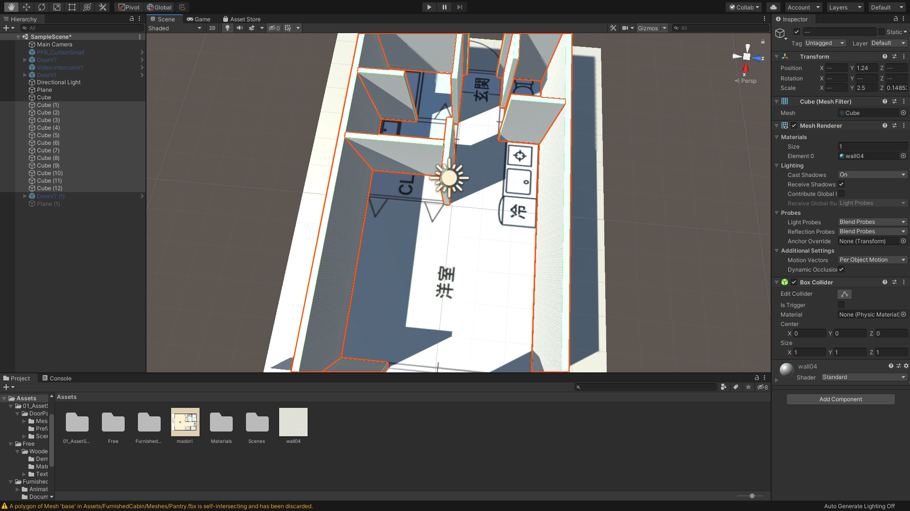

# オリジナルの部屋を作ろう

## 間取り図を入手する

 

今回は前回までの講習内容を参考にしながら、オリジナルのVR空間を作成していきたいと思います。

 

まずは間取り図を準備してください。

手元にある場合はそちらを利用してください。ない場合はネットで手頃な間取り図を入手しそちらを利用していきたいと思います。

 

## 新規でUnityプロジェクトを作成する

次にUnityで新規プロジェクトを作成し、Planeを配置します。  

そして先ほどダウンロードした間取り図をUnityにインポートし、Planeにドラッグ&ドロップしてください。  
これで間取り図が地面に描画されました。

 

次にCubeを作成します。    

UnityではScaleの「1 = 1m」の定義になっているので、こちらのCubeは1m × 1m × 1mの立方体ということになります。

こちらのCubeの大きさを参考に、間取り図が貼ってあるPlaneの大きさを変更しましょう。

 

間取り図の大きさが決まったら、あとは間取り図を参考に壁をCubeで作成していきます。  
こちらはちょっと細かい作業で、マウスが必須になるかと思うので準備して使用することをお勧めします。  

 

### 3D素材を使って作り込む

あとはひたすらAssetStoreなどから3D素材をダウンロードして作り込んでいきます。  
Unityアセットストア以外にも3D素材をダウンロードできるサイトが多数ありますので、お気に入りの素材を探してみてください。

また、壁紙や床などのマテリアル素材も利用してクオリティをあげていきましょう。

ライティングは全ての家具などを配置できてから追加します。

オブジェクトを配置し終わらないとベイク（焼き込み）ができないからです。

また、天井は一番最後に作りましょう。（屋根があると作りにくくなります）

細かい作業になりますが、コードを書かずUnityに慣れるかと思いますのでしっかり作り込みをしてみましょう。  
もし3D制作ソフトで部屋などを作れる方はそちらの素材をUnityにインポートして使用してもらっても構いません。

 

作り終わったら前回までの教材を参考に部屋の中を歩き回れるようにしてみましょう！

実際にプレイヤーとなって歩き回ってみると、意図しない隙間やライトの違和感などに気づくことがあります。